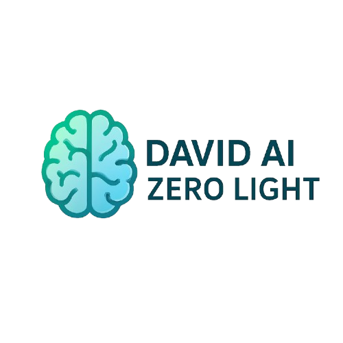

<p align="center">
  
</p>

# 🤖 David AI – Zero Light

**Model Name:** Zero Light  
**Author:** David  
**Email:** davidk76011@gmail.com  
**Purpose:** Offline low-resource AI assistant for building websites & desktop software  
**Optimized for:** 8 GB RAM • 8 GB VRAM • 80 GB Disk  
**Framework:** [Arya](https://github.com/david0154/Arya)  

## 🌟 What Is Zero Light?

A lightweight version of David AI built to run on lower-end PCs completely offline. It can:
- 🧠 Understand instructions via text
- 💻 Generate full code for software or websites
- 🎨 Add UI with clean structure
- ⚡ Use small models for fast execution

## 🖥️ System Requirements

| Component       | Minimum           |
|----------------|--------------------|
| RAM            | 8 GB               |
| VRAM (GPU)     | 8 GB (CUDA Optional)|
| Disk Space     | 80 GB              |
| Python         | 3.10 or later      |
| OS             | Windows 10/11      |

## 🚀 Installation

### 1. Clone This Repo
```bash
git clone https://github.com/david0154/David-zero-ai-light-.git
 ```

```bash
cd david-zero-light
```

### 2. Set Up Virtual Environment (Windows)
```bash
python -m venv venv
venv\Scripts\activate
```

### 3. Install Dependencies
```bash
pip install -r requirements.txt
```

## 🤖 First Run
```bash
python main.py
```

Then type what you want the AI to build:
```txt
Build a login form in HTML and CSS.
Create a simple calculator desktop app in Python.
Make a blog homepage layout.
```

## 📁 Project Structure
```
david-zero-light/
├── zero_light.py
├── requirements.txt
├── models_config_light.py
├── voice_light.py
├── main.py
└── README.md
```
## 📦 Full High Version Also Available

Looking for the full-featured high-performance version of David AI?

👉 **[David AI – Zero (High Version)](https://github.com/david0154/David-zero-ai)**

**Features of the Full Version:**
- Uses 3–4 large pretrained models (Code Llama, StarCoder2, Deepseek, CodeGen)
- Capable of building full apps like Facebook or Windows software
- Includes advanced voice + UI system
- Pretrained offline coding base + Arya framework integration
- Designed for 16+ GB RAM / 20+ GB VRAM machines
- Offers highly intelligent task chaining, code cleanup, and design with modern UI

## 📖 License

```
MIT License

Copyright (c) 2025 David

Permission is hereby granted, free of charge, to any person obtaining a copy
of this software and associated documentation files (the "Software"), to deal
in the Software without restriction, including without limitation the rights
to use, copy, modify, merge, publish, distribute, sublicense, and/or sell   
copies of the Software, and to permit persons to whom the Software is        
furnished to do so, subject to the following conditions:                     

The above copyright notice and this permission notice shall be included in   
all copies or substantial portions of the Software.                          

THE SOFTWARE IS PROVIDED "AS IS", WITHOUT WARRANTY OF ANY KIND, EXPRESS OR  
IMPLIED, INCLUDING BUT NOT LIMITED TO THE WARRANTIES OF MERCHANTABILITY,    
FITNESS FOR A PARTICULAR PURPOSE AND NONINFRINGEMENT. IN NO EVENT SHALL THE 
AUTHORS OR COPYRIGHT HOLDERS BE LIABLE FOR ANY CLAIM, DAMAGES OR OTHER      
LIABILITY, WHETHER IN AN ACTION OF CONTRACT, TORT OR OTHERWISE, ARISING     
FROM, OUT OF OR IN CONNECTION WITH THE SOFTWARE OR THE USE OR OTHER         
DEALINGS IN THE SOFTWARE.
```

